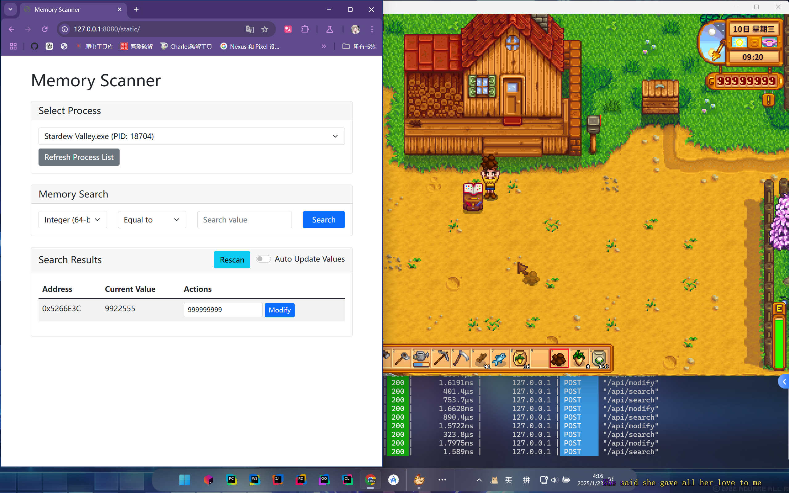

# 🎮 GoMemScanner-WebUI

> 🔍 A web-based memory scanner/editor similar to Cheat Engine, built with Go and modern web technologies.

[](https://opensource.org/licenses/MIT)
[](https://golang.org/)
[](https://www.microsoft.com/windows)

## 🖼️ Preview


*Memory Scanner Interface with Real-time Value Monitoring*

## ✨ Features

- 🌐 Clean and modern web interface
- ⚡ Real-time memory value monitoring
- 🔢 Multiple data type support
- 🔍 Advanced search operations
- 📋 Process list management
- ✏️ Memory value modification

## 🛠️ Supported Features

### 📊 Data Types
- 💻 Integer (32-bit)
- 💾 Integer (64-bit)
- 🌊 Float (32-bit)
- 🌐 Float (64-bit)

### 🔍 Search Operations
- ✅ Equal to
- ⬆️ Greater than
- ⬇️ Less than
- 📈 Value increased
- 📉 Value decreased

### 💾 Memory Operations
- 🔎 First scan
- 🔄 Next scan
- ✏️ Value modification
- 📊 Auto-update monitoring

## 📋 Requirements

- 🚀 Go 1.21 or higher
- 🪟 Windows OS (currently only supports Windows)
- 👑 Administrator privileges (required for memory access)

## 📥 Installation

1. Clone the repository:
```bash
git clone https://github.com/RexMignon/GoMemScanner-WebUI.git
cd GoMemScanner-WebUI
```

2. Install dependencies:
```bash
go mod tidy
```

3. Run the application:
```bash
go run .
```

4. Open your web browser and navigate to:
```
http://localhost:8080
```

## 📖 Usage

### 1️⃣ Process Selection
   - 🚀 Launch the application
   - 🔄 Click "Refresh Process List" to see available processes
   - ✅ Select the target process from the dropdown list

### 2️⃣ Memory Scanning
   - 📊 Select the data type (int32/int64/float32/float64)
   - 🎯 Choose the search operation (equal/greater/less/increased/decreased)
   - ⌨️ Enter the value to search for
   - 🔍 Click "Search" to start scanning

### 3️⃣ Result Management
   - 📋 View found memory addresses and their current values
   - 🔄 Use "Rescan" for subsequent searches based on previous results
   - ⚡ Enable "Auto Update Values" to monitor value changes in real-time

### 4️⃣ Memory Modification
   - ✏️ Enter a new value in the input field next to any result
   - 💾 Click "Modify" to change the memory value
   - 🔄 Values will update automatically if auto-update is enabled

## 🔧 Technical Details

### 🖥️ Backend
- 🚀 Written in Go
- 🪟 Uses Windows API for memory operations
- 🌐 Gin web framework for HTTP server
- 📦 Embedded static file serving

### 🎨 Frontend
- 💻 Modern HTML5/CSS3
- 🎯 Bootstrap 5 for UI components
- ⚡ Vanilla JavaScript for interactivity
- 🔄 Real-time updates using polling

### 💾 Memory Operations
- 📋 Process enumeration and access
- 🔍 Memory region scanning
- 🔄 Value type conversion
- ✏️ Memory read/write operations

## ⚠️ Security Considerations

- 👑 Requires administrator privileges
- 🔒 Only works with processes that allow memory access
- ⚠️ Some system processes may be protected
- ⚡ Use with caution to avoid program crashes

## 🤝 Contributing

Contributions are welcome! Please feel free to submit pull requests.

### How to Contribute
1. 🍴 Fork the repository
2. 🌿 Create your feature branch (`git checkout -b feature/AmazingFeature`)
3. 💾 Commit your changes (`git commit -m 'Add some AmazingFeature'`)
4. 📤 Push to the branch (`git push origin feature/AmazingFeature`)
5. 🎯 Open a Pull Request

## 📄 License

This project is licensed under the MIT License - see the [LICENSE](LICENSE) file for details.

## ⚠️ Disclaimer

This tool is for educational purposes only. Use it responsibly and only with programs you own or have permission to modify.

## 🌟 Star History

[](https://star-history.com/#RexMignon/GoMemScanner-WebUI&Date)

## 📊 Project Status


## 🤝 Support

If you like this project, please consider:
- ⭐ Star this repository
- 👁️ Watch for updates
- 🐛 Report bugs
- 💡 Suggest new features

---
Made with ❤️ by [RexMignon](https://github.com/RexMignon) 